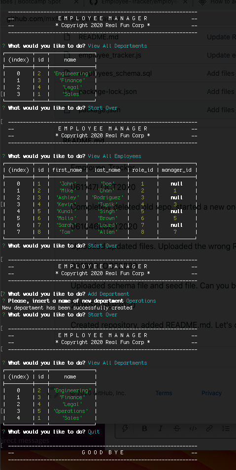

Employee_Tracker

This is a mySQL app that allows the user to view a company's employee structure.

View it in action: https://youtu.be/UhqRZ_p74UQ

Historic day-to-day updates:

221339LOCT2020

Received poor marks and helpful comments from the grading team.  

Uploaded new video with revisions:
https://youtu.be/5cYpGdNTd6Y

061147LOCT2020

Completely deleted old repo, started a new one.

061046LOCT2020

Uploaded updated files. Uploaded the wrong README.md. This happens, I suppose.

031900LOCT2020

Uploaded schema file and seed file. Can you believe it's October already?

291654LSEP2020

Created repository, added README.md. Let's do this.
